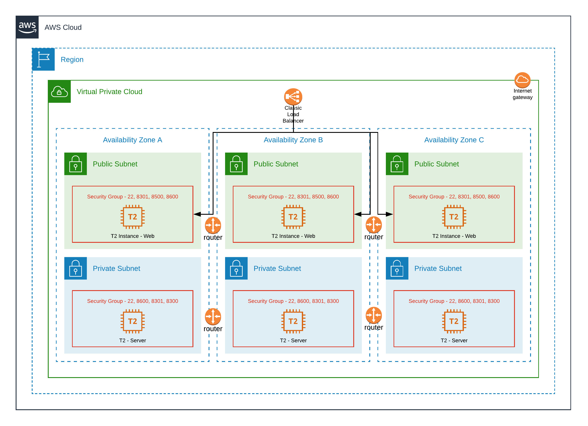

# Consul Terransible
This reposiory will help you setup [Consul](https://www.consul.io/) Cluster (2 clients and 3 Servers) using Terraform and Ansible.

## Diagrams - Infra


## How to setup Consul Cluster using Terrform and Ansible Scripts
### Preparing master machine
Please refer to file - [client-setup-script.sh](client-setup-script.sh)

```
chmod 777 client-setup-script.sh
./client-setup-script.sh
```

### Initialise and Plan
```
git clone https://github.com/dhavlev/consul-terransible.git
cd consul-terransible/terraform
terraform init
terraform plan
```

### Apply
```
terraform apply ----auto-approve
```

### Destroy
```
terraform destroy ----auto-approve
```

## How to Execute Ansible Playbook independent of Terraform
### Setup
```
ansible-playbook -i non-production master-install-consul.yaml --tags "setup"
```

### Maintenance
```
ansible-playbook -i non-production master-install-consul.yaml --tags "consul-start" | "consul-stop" | "consul-status"
```

## Troubleshoot
### Ansible
1. ansible the authenticity of host can't be established  
   Open /etc/ansible/ansible.cfg and set 'host_key_checking' to false
2. Problem while identing the config.json  
   refer to [link](https://ansiblemaster.wordpress.com/2016/07/29/jinja2-lstrip_blocks-to-manage-indentation/)

